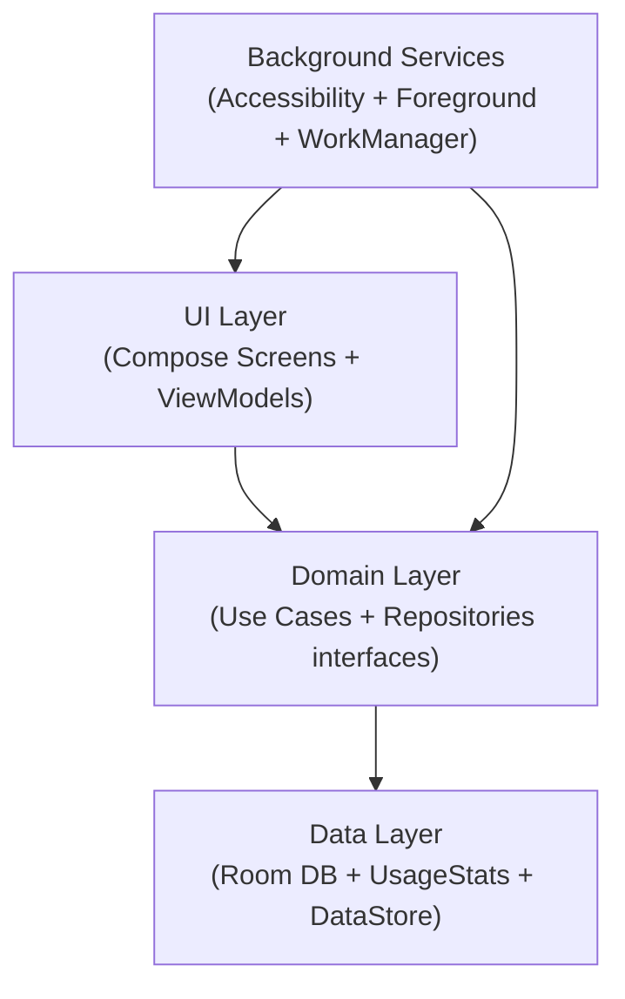
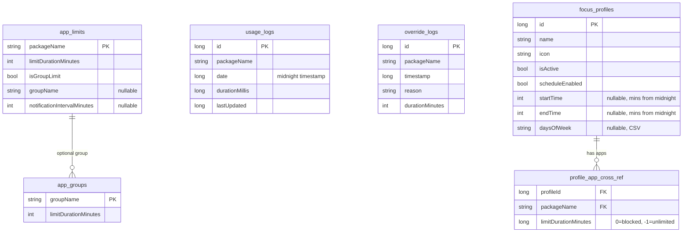

# MindFul Scrolling — Instant Context Guide

> **Package**: `com.mindfulscrolling.app` · **Min SDK**: 26 · **Target SDK**: 34 · **DB Version**: 4

A digital-wellness Android app (Kotlin + Jetpack Compose) that **monitors screen time**, **enforces app limits**, and **blocks distracting apps** via an Accessibility Service overlay.

---

## Architecture at a Glance

```
Clean Architecture  ·  MVVM  ·  Hilt DI  ·  Single-Activity (Compose Navigation)
```



---

## Technology Stack

| Category | Tech |
|----------|------|
| Language | Kotlin |
| UI Framework | Jetpack Compose + Material 3 |
| DI | Hilt (KSP) |
| Local DB | Room (v4, 6 entities, 5 DAOs) |
| Preferences | DataStore Preferences |
| Background | AccessibilityService, Foreground Service, WorkManager |
| Navigation | Compose Navigation (single `NavHost` in `MainActivity`) |
| Async | Kotlin Coroutines + Flow |
| Build | Gradle KTS, version catalog (`libs.versions.toml`) |

---

## Project Structure

```
app/src/main/java/com/mindfulscrolling/app/
├── MainActivity.kt              # Single Activity, NavHost entry point
├── MindfulScrollingApp.kt       # @HiltAndroidApp Application class
│
├── data/
│   ├── datasource/
│   │   └── UsageStatsDataSource.kt      # Wraps Android UsageStatsManager API
│   ├── local/
│   │   ├── AppDatabase.kt               # Room DB (version 4)
│   │   ├── BreakPreferences.kt          # DataStore for break state
│   │   ├── dao/
│   │   │   ├── AppLimitDao.kt
│   │   │   ├── UsageLogDao.kt
│   │   │   ├── AppGroupDao.kt
│   │   │   ├── OverrideLogDao.kt
│   │   │   └── FocusProfileDao.kt
│   │   ├── entity/                      # ← See "Database Schema" below
│   │   └── model/
│   │       └── DailyUsageSummary.kt
│   └── repository/
│       ├── AppRepositoryImpl.kt         # Implements AppRepository
│       ├── SettingsRepositoryImpl.kt    # Implements SettingsRepository
│       ├── UsageRepositoryImpl.kt       # Implements UsageRepository
│       └── UserPreferencesRepository.kt # Theme mode via DataStore
│
├── di/
│   ├── DatabaseModule.kt         # Room DB + DAO providers
│   └── RepositoryModule.kt       # Binds repo interfaces → impls
│
├── domain/
│   ├── manager/
│   │   └── PermissionManager.kt  # Checks Usage Stats / Overlay / Accessibility
│   ├── model/
│   │   ├── AppInfo.kt            # name, packageName, icon, isSystemApp
│   │   └── AnalyticsModels.kt    # AnalyticsData, BarData, AppUsageItem, UsageSession, DailyAnalytics
│   ├── repository/               # Interfaces
│   │   ├── AppRepository.kt      # Limits, Groups, Usage, Overrides, Profiles, Break
│   │   ├── SettingsRepository.kt  # Limit CRUD
│   │   └── UsageRepository.kt    # Usage logging, sync, analytics
│   └── usecase/                   # 17 use cases
│       ├── CheckLimitExceededUseCase.kt
│       ├── CreateAppGroupUseCase.kt
│       ├── GetAllAppLimitsUseCase.kt
│       ├── GetAnalyticsDataUseCase.kt
│       ├── GetAppGroupsUseCase.kt
│       ├── GetAppLimitUseCase.kt
│       ├── GetAppUsageStatsUseCase.kt
│       ├── GetDailyUsageUseCase.kt
│       ├── GetUsageHistoryUseCase.kt
│       ├── LogEmergencyOverrideUseCase.kt
│       ├── ManageBreakUseCase.kt
│       ├── ManageFocusProfilesUseCase.kt
│       ├── RemoveAppLimitUseCase.kt
│       ├── SetAppLimitUseCase.kt
│       ├── SettingsUseCase.kt
│       ├── SyncUsageUseCase.kt
│       └── UpdateUsageUseCase.kt
│
├── service/
│   ├── AccessibilityInterventionService.kt  # Core monitoring engine
│   ├── AppMonitoringService.kt              # Foreground service (fallback)
│   └── UsageNotificationManager.kt          # Periodic usage alert notifications
│
├── ui/
│   ├── analytics/       # AnalyticsScreen + ViewModel
│   ├── common/          # PinDialog (strict mode unlock)
│   ├── dashboard/       # DashboardScreen, TakeABreakScreen, TakeABreakDialog, UsageHistory
│   ├── limits/          # AppListScreen + ViewModel (per-app limits)
│   ├── main/            # MainScreen (bottom nav: Dashboard, Limits, Analytics, Modes)
│   ├── modes/           # ModesScreen
│   ├── onboarding/      # OnboardingScreen + ViewModel (permission setup)
│   ├── overlay/         # OverlayManager + OverlayScreen (system alert window)
│   ├── profiles/        # FocusProfilesScreen, EditProfileScreen + ViewModels
│   ├── settings/        # SettingsScreen + ViewModel
│   └── theme/           # Color.kt, Theme.kt, Type.kt
│
└── worker/
    └── SyncUsageWorker.kt  # Periodic (15 min) usage data sync via WorkManager
```

---

## Database Schema (Room, Version 4)



---

## Navigation Graph

```
MainActivity NavHost
│
├── "onboarding"  → OnboardingScreen    (permission setup wizard)
├── "main"        → MainScreen          (bottom nav hub)
│   ├── Tab: Dashboard  → DashboardScreen
│   ├── Tab: Limits     → AppListScreen
│   ├── Tab: Analytics  → AnalyticsScreen
│   └── Tab: Modes      → ModesScreen
├── "settings"    → SettingsScreen
├── "profiles"    → FocusProfilesScreen
├── "edit_profile/{profileId}" → EditProfileScreen
├── "history"     → UsageHistoryScreen
└── "take_break"  → TakeABreakScreen
```

**Start destination** is determined at runtime:
- If all permissions granted → `"main"` (also starts `AppMonitoringService`)
- Otherwise → `"onboarding"`

---

## Core Features & How They Work

### 1. Screen Time Monitoring
- **`UsageStatsDataSource`**: Wraps Android's `UsageStatsManager`. Uses `queryAndAggregateUsageStats()` — the **exact same API as Android Digital Wellbeing** — as the authoritative source for all screen time totals. Hourly breakdowns from `queryEvents` are normalized to match these totals.
- **`DashboardViewModel`**: Uses `UsageStatsDataSource` directly as the **single source of truth** for all dashboard metrics. No Room DB flow is used for dashboard totals (eliminates data race). Refreshes every **30 seconds** via coroutine loop.
- **`UsageRepositoryImpl`**: Clamps `endTime` to `System.currentTimeMillis()` for today to prevent querying future timestamps.
- **`AccessibilityInterventionService`** (primary): Listens for `TYPE_WINDOW_STATE_CHANGED` → detects foreground app → starts a polling loop (100ms) that increments usage via `UpdateUsageUseCase`.
- **`AppMonitoringService`** (fallback foreground service): Queries `UsageStatsManager` every 1s to detect foreground app and log usage.
- **`SyncUsageWorker`**: Periodically (15min) syncs historical data from `UsageStatsManager` into Room (used for limits, not dashboard display).

### 2. App & Group Limits
- Per-app daily limits stored in `app_limits` table (minutes).
- Optional group limits via `app_groups` + `isGroupLimit` flag.
- **`CheckLimitExceededUseCase`**: Compares today's usage against the limit; also checks active Focus Profile limits via `ProfileAppCrossRef`.
- When exceeded → `OverlayManager.showOverlay()` blocks the app with a full-screen Compose overlay rendered via `WindowManager`.

### 3. Focus Profiles
- Named profiles (e.g., "Work", "Sleep") with icon, schedule, and per-app rules.
- `ProfileAppCrossRef.limitDurationMinutes`: `0` = blocked, `-1` = unlimited (whitelisted), `>0` = custom limit.
- Profiles can be manually activated/deactivated or scheduled by time of day + day of week.

### 4. Take a Break Mode
- **TakeABreakScreen** layout: Duration chips → **Start Break button** (placed near top for easy access) → Focus Profiles → Essential Apps list.
- **Focus Profiles integration**: Multi-select `FilterChip`s showing profile names. Selecting a profile auto-whitelists all its apps. Multiple profiles can be selected simultaneously. Smart deselect removes only apps unique to that profile.
- State persisted in `BreakPreferences` (DataStore): `isBreakActive`, `breakEndTime`, `breakWhitelist`.
- `ManageBreakUseCase` manages start/stop/whitelist logic. **System whitelist** includes Phone, Dialer, InCallUI, Telecom, Camera, Keyboard, SystemUI, and self — these are **never blocked** during breaks.
- `AccessibilityInterventionService` checks break state *before* app limits — whitelisted apps are allowed, everything else is blocked. Passes `breakEndTime` and whitelist to the overlay.
- Break ends automatically when timer expires; **no manual "End Break" button** on overlay.
- **Incoming calls always work**: InCallUI and Telecom packages are in the system whitelist.

### 5. Intervention Overlay
- **`OverlayManager`** (Singleton): Creates a `TYPE_APPLICATION_OVERLAY` window with a `ComposeView`. Passes `breakEndTime`, `whitelistedApps`, and `onLaunchApp` to the screen.
- Renders **`OverlayScreen`** with two modes:
  - **Limit exceeded**: Shows usage info + emergency override option (math/typing challenge).
  - **Break mode**:
    - **Live countdown timer**: `LaunchedEffect`-driven ticker using `breakEndTime`, updates every second (`mm:ss`).
    - **3-phase breathing animation**: Breathe In (4s, cyan) → Hold (2s, amber) → Breathe Out (4s, teal) with synced text fading, glow ring shimmer, and bubble alpha.
    - **Rotating tips** with `AnimatedContent` crossfade transitions.
    - **📱 Essential Apps**: Collapsible section showing whitelisted app icons with tap-to-launch.
    - **📞 Phone & 📷 Camera**: Floating buttons at bottom-left and bottom-right corners (dynamically resolves device's default dialer/camera).
- **Emergency Override**: Logs to `override_logs` via `LogEmergencyOverrideUseCase`, grants 5-min bypass.
- On dismiss → `performGlobalAction(GLOBAL_ACTION_HOME)` sends user to home screen.

### 6. Usage Notifications
- **`UsageNotificationManager`** fires periodic "⏱️ Usage Alert" notifications.
- Global interval (default 30min) or per-app interval via `AppLimitEntity.notificationIntervalMinutes`.
- Debounces per-app to avoid spamming.

### 7. Analytics
- **Dashboard**:
  - `queryAndAggregateUsageStats()` is the **single source of truth** — matches Android Digital Wellbeing exactly.
  - **30-second auto-refresh** — no stale data, no Room DB data race.
  - Animated progress ring toward 4h daily goal.
  - **Personalized insight** — 20 sentiment-based messages with data guards against insufficient data (early morning, empty history, zero-days excluded from averages).
  - **7-day sparkline** — Canvas line chart with gradient fill, dashed goal line, today highlighted. Only shown when real non-zero data exists.
  - `dataLoaded` flag prevents showing zeros before first fetch.
- **AnalyticsScreen**: Hourly usage chart, per-app breakdown with percentages, session timeline.
- Data sourced from `UsageStatsManager` authoritative `queryAndAggregateUsageStats` for totals, with event-based hourly breakdown normalized to match.
- `endTime` clamped to `now` for today to prevent future-timestamp queries.

### 8. Settings
- Theme mode (Light / Dark / System) persisted via `UserPreferencesRepository` (DataStore).
- Permission management (re-navigate to onboarding).
- Notification toggle + interval config.
- Strict mode configuration.

---

## Required Permissions

| Permission | Purpose |
|------------|---------|
| `PACKAGE_USAGE_STATS` | Query `UsageStatsManager` for app usage data |
| `SYSTEM_ALERT_WINDOW` | Draw intervention overlay on top of other apps |
| `BIND_ACCESSIBILITY_SERVICE` | Monitor foreground app changes + scrolling events |
| `FOREGROUND_SERVICE` | Keep monitoring service alive |
| `FOREGROUND_SERVICE_SPECIAL_USE` | Android 14+ foreground service type |
| `POST_NOTIFICATIONS` | Usage alert notifications |
| `QUERY_ALL_PACKAGES` | List all installed apps |
| `VIBRATE` | Haptic feedback |

**Onboarding flow** checks and guides the user through granting: Usage Stats → Overlay → Accessibility Service.

---

## Key Patterns & Conventions

1. **Clean Architecture**: UI → Domain (UseCases + Repository interfaces) → Data (implementations).
2. **MVVM**: Each screen has a `@HiltViewModel` ViewModel exposing `StateFlow<UiState>`.
3. **Hilt DI throughout**: Services, ViewModels, Repositories, Managers all use `@Inject`.
4. **Room entities use `Entity` suffix**, DAOs use `Dao` suffix.
5. **Flows everywhere**: Repository methods return `Flow<T>` for reactive UI updates.
6. **Date convention**: Days are represented as midnight timestamps (`Calendar.HOUR_OF_DAY = 0`).
7. **Break state**: Stored in DataStore (not Room) for fast reads from the Accessibility Service.

---

## File Quick Reference

| What you want to do | Go to |
|---------------------|-------|
| Change limit-checking logic | `CheckLimitExceededUseCase.kt` |
| Modify the blocking overlay UI | `OverlayScreen.kt` |
| Change how foreground app is detected | `AccessibilityInterventionService.kt` |
| Add a new Room entity | `entity/` → `AppDatabase.kt` → `DatabaseModule.kt` |
| Add a new screen/route | `MainActivity.kt` (NavHost) |
| Change theme/colors | `ui/theme/Color.kt`, `Theme.kt`, `Type.kt` |
| Modify Take a Break flow | `ManageBreakUseCase.kt` + `TakeABreakScreen.kt` |
| Edit Focus Profile logic | `ManageFocusProfilesUseCase.kt` + `EditProfileScreen.kt` |
| Change notification behavior | `UsageNotificationManager.kt` |
| Modify analytics calculations | `UsageStatsDataSource.kt` + `AnalyticsViewModel.kt` |
| Add a new DI binding | `di/DatabaseModule.kt` or `di/RepositoryModule.kt` |
| Change onboarding steps | `OnboardingScreen.kt` + `OnboardingViewModel.kt` |

---

## Build & Run

```bash
# Debug build
./gradlew assembleDebug

# Install on connected device
./gradlew installDebug

# Run all tests
./gradlew test
```

> **Note**: The app requires a physical device (or emulator with Play Services) for full functionality due to `UsageStatsManager` and `AccessibilityService` requirements.

---

*Last updated: 2026-02-24 22:57 IST*
